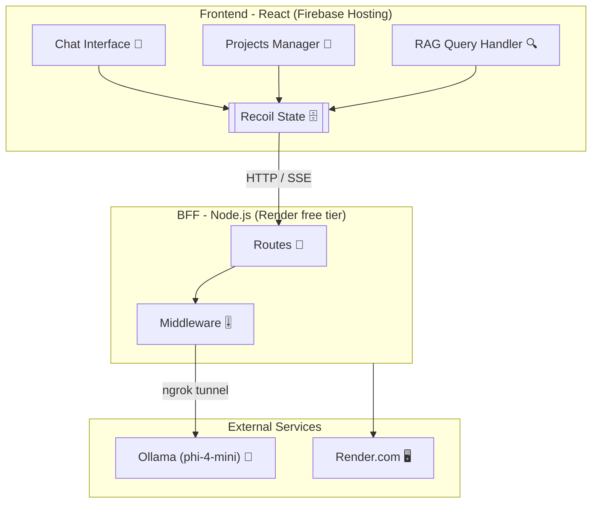

# Frontend Coding Assignment Solution

## Quick Demo: 

<div align="center">

https://github.com/user-attachments/assets/688817d0-af30-4250-9843-6820574617df

</div>

## Assignment Overview

| **Aspect**         | **Details**               |
| ------------------ | ------------------------- |
| **Understanding**  | ~2 hours                  |
| **Implementation** | ~10 hours                 |
| **Total Time**     | ~12 hours                 |
| **AI Usage**       | Allowed (ChatGPT, Claude) |

## Features

### Project Management

- Create, update, and delete projects
- Responsive UI with Figma-accurate design
- Real-time state management with Recoil

### Chatbot (SSE)

- Real-time streaming responses via Server-Sent Events
- Markdown rendering with custom parsers
- HTML content rendering
- Error recovery and retry mechanisms

### RAG Query System

- Markdown-formatted responses via SSE
- Interactive citation system:
    - Format: `[{docnum}-{index}]`
    - Click quote → Shows all citations for that docnum
    - Click paragraph → Shows all related quotes
- Custom citation UI components

## Architecture



---

## Tech Stack

| Layer              | Technologies                                         |
| ------------------ | ---------------------------------------------------- |
| **Frontend**       | React 18 • TypeScript • Vite • Tailwind CSS • Recoil |
| **Backend**        | Node.js • Express • SSE • CORS                       |
| **Infrastructure** | Firebase Hosting • Render.com • Ngrok                |
| **AI/LLM**         | Ollama • Custom Guardrails                           |
| **Dev Tools**      | ESLint • Prettier • npm Workspaces                   |

---

## Project Structure

```

frontend-assignment/
├── packages/
│ ├── web/ # React frontend
│ │ ├── src/
│ │ │ ├── api/ # API layer & streaming
│ │ │ ├── atoms/ # Recoil state
│ │ │ ├── components/ # UI components
│ │ │ ├── hooks/ # Custom hooks
│ │ │ └── types/ # TypeScript types
│ │ └── dist/ # Production build
│ │
│ └── server/ # BFF server
│ ├── routes/ # API endpoints
│ ├── middleware/ # Guards & rate limiting
│ └── services/ # Business logic
│
├── firebase.json # Firebase config
├── package.json # Workspace root
└── README.md

```

---

## Available Scripts

| Command              | Description                                         |
| -------------------- | --------------------------------------------------- |
| `npm run dev`        | Start both frontend and backend in development mode |
| `npm run dev:server` | Start backend server only                           |
| `npm run dev:web`    | Start frontend dev server only                      |
| `npm run build`      | Build frontend for production                       |
| `npm run start`      | Start production backend server                     |

---

## ⚠️ Caution & Deployment Notes

### Backend (BFF)

- Hosted on **Render (free tier)**
- ⚠️ May **sleep after inactivity** — the first request can take 20–50 seconds to respond depending on the request load time and model initialization

### LLM Model:

Choice: **Ollama (phi-4-mini model)**

- Runs **locally** on the developer's machine
- Exposed to the BFF server via **ngrok tunnel**
- Chosen to **save hosting costs**;
    - Model availability depends on the developer's machine being online

### Frontend

- Hosted on **Firebase Hosting** (free tier)

> **Note:**
> This architecture is for **demo purposes only**. For production, Ollama (or other LLMs) should be deployed on a cloud provider or as a managed/containerized service.

---

## Security and Guardrails

- **Rate Limiting**: 20 requests per 2 minutes per IP
- **Query Guardrails**: Local and LLM-based safety checks
- **Input Sanitization**: Max 1000 character queries
- **CORS Configuration**: Controlled origin access
- **Error Boundaries**: Graceful error handling

---

## API Endpoints

| Endpoint   | Method          | Description                      |
| ---------- | --------------- | -------------------------------- |
| `/health`  | GET             | Health check                     |
| `/project` | GET/POST/DELETE | Project CRUD operations          |
| `/answer`  | GET             | SSE streaming for chat responses |

---

## Implementation Highlights

### SSE Implementation

- Automatic reconnection on failure
- Chunk accumulation for smooth streaming
- Proper cleanup on component unmount

### Citation System

- Custom parser for `[#-#]` format
- Interactive click handlers
- Alert-based quote display

### State Management

- Centralized Recoil atoms
- Optimistic UI updates
- Persistent project storage

---

## Troubleshooting

| Issue           | Solution                              |
| --------------- | ------------------------------------- |
| CORS errors     | Ensure backend allows frontend origin |
| SSE not working | Check if Ollama is running locally    |
| Render sleeping | First request takes 30-50s to wake    |
| Build fails     | Clear node_modules and reinstall      |

---

## 📄 License

Refer to the LICENSE file for details.
